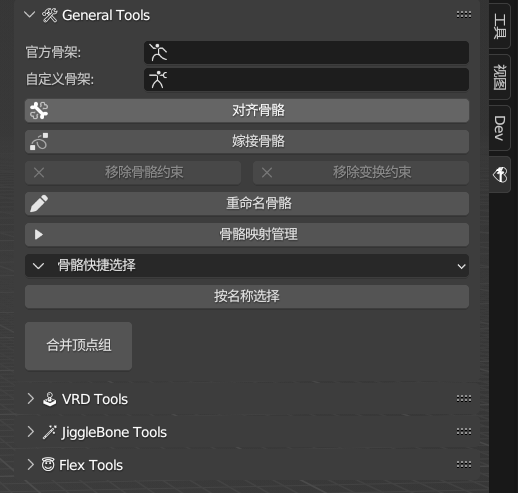
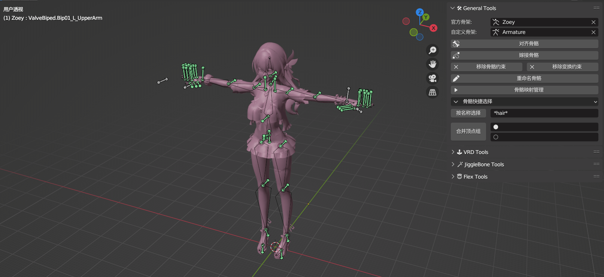
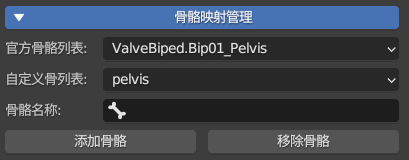
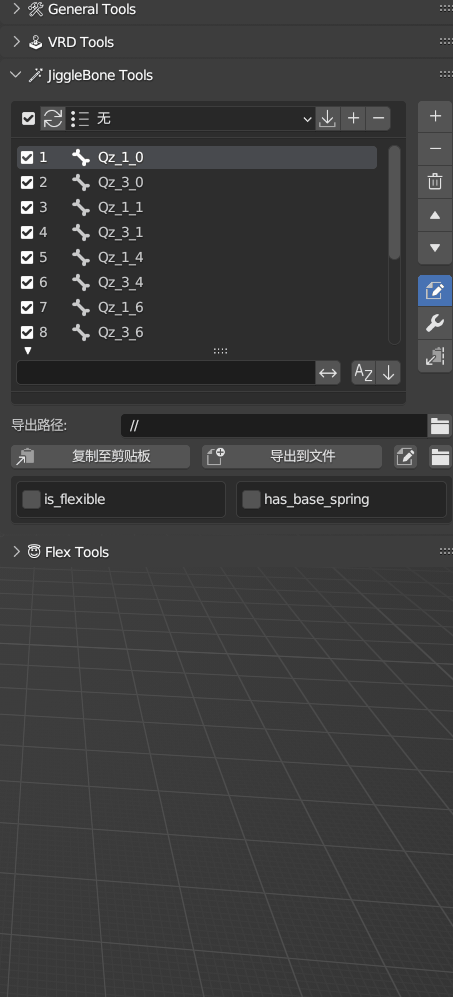
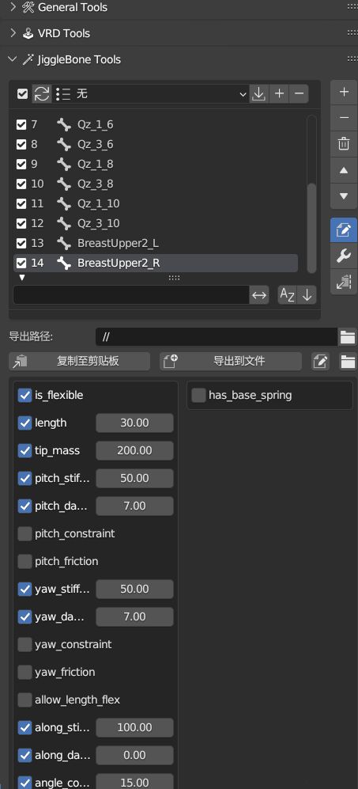

# Blender_L4D2_Character_Tools
这是一个旨在提升求生之路2人物Mod制作效率的插件！(*´▽｀)ノノ

## 特性
- 运用预设的骨骼映射关系快速进行骨骼对齐与合并
- 插入动作关键帧辅助生成VRD文本
- 编写抖动骨骼参数，支持批量设置，文本输入输出，预设管理
- 通过操控原始形态键的混合数值生成适配自己面部规则的表情集

## 安装方式
1. 在[发行版](https://github.com/Saberafter/Blender_L4D2_Character_Tools/releases)页面下载最新的zip压缩包
2. 打开Blender，找到编辑(Edit)-偏好设置(Preferences)-插件(Add-ons)
3. 在插件(Add-ons)选项卡中安装(Install)这个压缩包并启用(√)

## 使用说明
📌 **操作面板**: 

- 安装并启用插件后,在3D视图的右侧面板(N键呼出)中可以找到插件的操作面板,点击💝图标即可展开。

  

📌 **对齐骨骼**: 

1. 在插件面板中设置"官方骨架"和"自定义骨架"对象。
2. 点击"对齐骨骼"按钮,插件会自动为官方骨架的主要骨骼添加复制位置约束,约束目标为自定义骨架中相应部位的骨骼。骨骼的对应关系取自预设的骨骼映射字典。

3. 对骨操作补充：使用"对齐骨骼"功能创建骨骼约束后,先设置一次静置姿势以定位骨骼,然后移除约束完成对齐操作。

📌 **骨骼映射管理**: 

- "骨骼映射列表"分为两栏:第一栏为"官方骨骼列表",第二栏为与之对应的"自定义骨列表"。例如,官方骨架的"pelvis"骨骼对应自定义骨架的"hips"和"pelvis"骨骼。
- 3D视图选中自定义骨架并进入姿态模式,界面上会显示"骨骼名称"栏。在上两栏选择需要映射的一组"官方骨骼"和"自定义骨骼",点击"添加骨骼"按钮,即可将第三栏设置好的骨骼添加到"自定义骨列表"中,界面会实时刷新映射关系。

  

- 通过编辑骨骼映射,可以灵活处理预设字典未包含的骨骼名称,无需离开Blender即可完成字典的维护。

📌 **嫁接骨骼**: 

- 嫁接流程分为两种:

   - 将自定义骨骼重命名为官方骨骼名称,然后使用插件的"合并骨骼"功能将同名骨骼及权重合并至官方骨架。
   - 保留原骨骼名称,使用插件重新设置骨骼的父子级关系。

[轻语老师的视频](https://www.bilibili.com/video/BV1414y1U7JX?t=432.4&p=3)
- "嫁接骨骼"功能利用骨骼映射关系和骨骼间的距离判定,自动为重合的骨骼设置父子级关系。
- "嫁接骨骼"有两种主要模式和一种特殊模式:
  1. 未选中任何骨骼时,对全部骨骼进行嫁接操作。
  2. 选中部分骨骼时,只对选中的骨骼进行嫁接操作。
  3. 特别的,多选骨骼时,如果选中了官方骨骼,其他选中的骨骼(无论是否存在映射关系)都会成为该官方骨骼的子级。
- 插件提供了"重命名骨骼"功能,可根据骨骼映射字典批量修改骨骼名称。

📌 **VRD**: 
- 关于借助人物动作辅助生成VRD文本的原理就不讲了，这里主要讲解使用插件生成VRD文本的流程过一遍插件的VRD相关功能。
1. 选中官方骨架,点击"生成VRD动作",插件会自动为驱动骨骼创建名为"VRD"和"VRD_Foot"的动作,分别用于制作裙子VRD、修正持枪动作以及修复高跟鞋角色的IK。之后可以参考驱动骨骼的动作,自行为程序骨骼添加关键帧。

2. 在"VRD项目管理"中新建项目,项目数量应与VRD动作数量一致。为每个项目绑定相应的VRD动作。这里解释一下，因为如果想得到正确的足VRD坐标，和动过腿的动作共用一个动作肯定是不行的(虽然可以断开，但操作麻烦不方便修改)，而手和腿没有冲突可以放一个动作里，所以得看情况分开处理VRD的辅助动作。
3. 在VRD项目中添加程序骨骼和驱动骨骼,列表中同一行的骨骼相互对应。程序骨骼列表每一项右侧的数字为VRD参数中的第一组角度值。
4. 设置好骨骼列表后,在面板下方选择导出路径和文本格式,即可导出VRD文本。

📌 **飘骨**: 
- 飘骨工具以骨骼列表为核心,用于管理骨骼的抖动参数。添加骨骼后,选中列表中的骨骼,在右侧参数面板中可以详细设置该骨骼的各类抖动参数。导出的文本会自动格式化为编译器可识别的格式。
- 插件提供了一系列功能,提高抖动参数的编辑效率:
  1. "同步"按钮可同步骨骼列表和3D视图中的选中状态,便于在两个视图间切换浏览。

  2. "预设"功能可保存和载入抖动参数配置,支持多选骨骼批量应用预设。  

  3. 右侧参数面板开关下面的的扳手按钮用于批量设置参数,支持多选骨骼统一调整数值,也可设置数值范围实现参数的递增或递减。

  4. 参数面板最后一个按钮可以从剪贴板导入外部文件中复制的标准格式抖动参数。

  
  

📌 **表情**: 
- 表情工具基于自定义原模的形态键,通过混合这些形态键的变形数值,生成适配目标面部规则的新形态键。
- MMD模型和VRC模型各自之间的形态键名称和表情通常是一致的,因此可以通过记录形态键名称和变形数值,构建可复用的形态键混合字典。
- 插件内置了一些形态键混合字典,下拉菜单中的AU表情对应最终生成的形态键,每个AU表情绑定了一套或多套用于混合的形态键组合。这些内容都可以在Blender中进行编辑。
- 这里视频+文字展示一下基本流程：
  1. 通过"捕捉形态键"功能记录形态键,添加到混合表情集的形态键列表中。 
  2. 使用"批量创建"功能，选择我们面部规则需要的表情和顺序生成新的形态键。
  3. "整理形态键",只保留使用插件生成的表情。
<video src="assets/13.mp4" controls title="表情"></video>

## 致谢
- 抹茶芝士✰：对骨脚本&灵感来源
- 残剑斩龙：3DMAX的VRD插件思路
- [SourceOps](https://github.com/bonjorno7/SourceOps)：获取骨骼位置/旋转坐标
- [BoneAnimCopy](https://github.com/kumopult/blender_BoneAnimCopy)：骨骼映射思路
- 发布人物制作教程的作者们

这个插件是为了帮助"求生之路2"的Mod制作者们更高效地进行制作工作。希望这个插件可以使他们的工作变得更轻松。

如果你对插件有使用问题或者功能建议，欢迎你在Github上提交issue。
