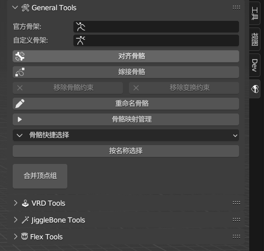
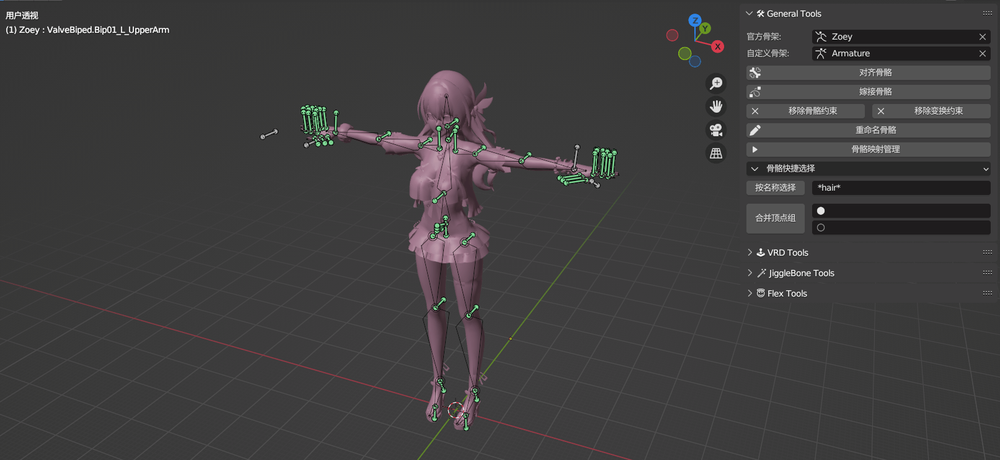
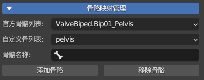
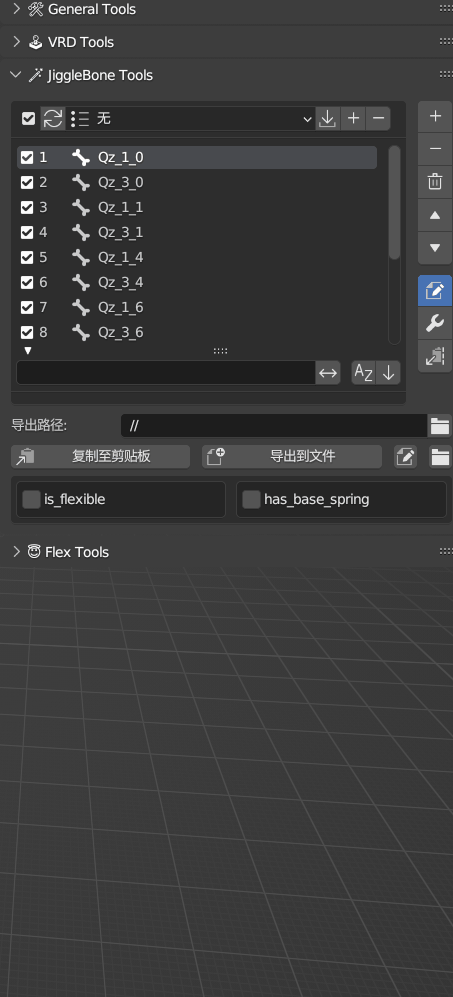
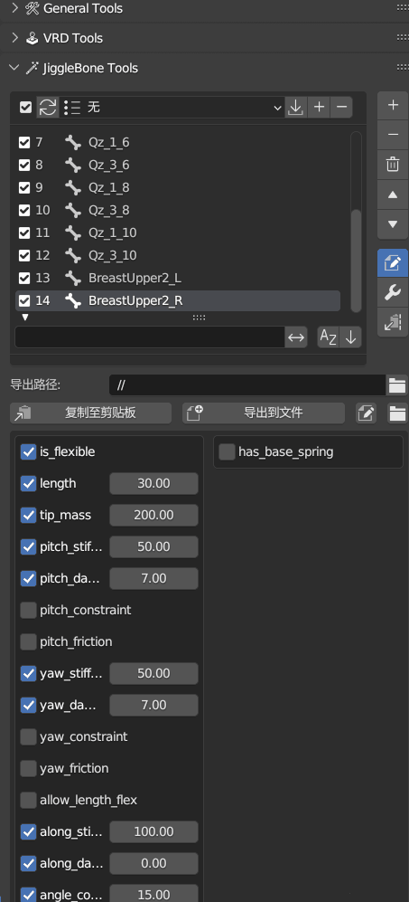

    <h1>L4D2 Character Tools</h1>
    
A Blender add-on designed to improve the efficiency of making Left 4 Dead 2 character mods (*´▽｀)ノノ

     
    

    
    

*Read this in other languages: [English](README_EN.md), [简体中文](README.md).*

## 🚩 Introduction
⚠️ This add-on's code was assisted by the AI language model ChatGPT. It is developed based on my personal workflow and habits in mod making, trying to consider versatility and extensibility, but there may still be potential bugs or compatibility issues.

📢 If you encounter any problems during use or have any suggestions for improvement, you are welcome to submit an Issue in the Github repository or contact me. I will review them carefully and strive to meet everyone's needs.

## 💡 Features
- ✨ Quickly align and merge bones using preset bone mapping relationships
- ✨ Insert action keyframes to assist in generating VRD text
- ✨ Quickly write jigglebone parameters, supporting batch settings, text input/output, and preset management
- ✨ Generate an expression set that adapts to your own facial rules by manipulating the blend values of the original shape keys

## 📥 Installation
1. Download the latest zip archive from the [Releases](https://github.com/Saberafter/Blender_L4D2_Character_Tools/releases) page.
2. Open Blender, go to Edit - Preferences - Add-ons.
3. Click Install, select the downloaded zip file, and enable (√) the add-on.

## 🗝 Instructions
📌 **Operation Panel**: 
- After installing and enabling the add-on, you can find the add-on's operation panel in the right panel of the 3D viewport (press N to bring it up). Click the 💝LCT icon to expand it.

  

📌 **Align Bones**: 
1. Set the "Official Armature" and "Custom Armature" objects in the add-on panel.
2. Click the "Align Bones" button. The add-on will automatically add a Copy Location constraint to the main bones of the official armature, targeting the corresponding bones in the custom armature. The bone correspondence is taken from the preset bone mapping dictionary.

3. Supplementary operation for bone alignment: After creating bone constraints using the "Align Bones" function, set a rest pose once to position the bones, and then remove the constraints to complete the alignment operation.

📌 **Bone Mapping Management**: 
- The "Bone Mapping List" is divided into two columns: the first column is the "Official Bone List", and the second column is the corresponding "Custom Bone List". For example, the "pelvis" bone of the official armature corresponds to the "hips" and "pelvis" bones of the custom armature.
- Select the custom armature in the 3D viewport and enter Pose Mode. The "Bone Name" column will appear on the interface. Select a set of "Official Bone" and "Custom Bone" to be mapped in the upper two columns, click the "Add Bone" button, and the bone set in the third column will be added to the "Custom Bone List". The interface will refresh the mapping relationship in real-time.

  

- By editing the bone mapping, you can flexibly handle bone names not included in the preset dictionary without leaving Blender to maintain the dictionary.

📌 **Graft Bones**: 
- In the usual grafting process, bone operations can be divided into two types:
   - Use an add-on to merge the weights of the custom bones to the official bones, and delete the custom bones. This is a more common method, because many games do not allow unofficial bones or do not automatically collapse custom bones.
   - Keep the original custom bones, and use an add-on to reset the parent-child relationship of the bones. This is the add-on function to be introduced next, which mainly relies on the bone mapping relationship used in the bone alignment stage. This method can be used on the premise that bones are collapsed through the $bonemerge parameter during compiling, which is also a commonly used method in the 3DMAX workflow.

- The "Graft Bones" function automatically sets parent-child relationships for overlapping bones using bone mapping relationships and distance judgments between bones.
- Three usage cases of the "Graft Bones" function:
  1. When no bones are selected, the grafting operation is performed on all bones.
  2. When some bones are selected, the grafting operation is performed only on the selected bones.
  3. Specially, when selecting multiple bones, if an official bone is selected, other selected bones overlapping with the official bone (whether there is a mapping relationship or not) will become the children of the official bone.

📌 **VRD**: 
- The principle of using character actions to assist in generating VRD text will not be repeated here. This mainly explains the process of using the add-on to generate VRD text and goes through the VRD-related functions of the add-on.
1. Select the official armature, click "Generate VRD Action". The add-on will automatically create actions named "VRD" and "VRD_Foot" for the driving bones, which are used to make skirt VRD, correct gun-holding actions, and fix the IK of high-heeled characters, respectively. After that, you can refer to the action of the driving bone and add keyframes to the procedural bone yourself.

2. Create a new project in "VRD Project Management". The number of projects should be consistent with the number of VRD actions. Bind the corresponding VRD action for each project. Here is an explanation: if you want to get the correct foot VRD coordinates, sharing an action with a leg that has been moved is definitely not possible (although it can be disconnected, the operation is troublesome and not easy to modify), while hands and legs have no conflict and can be placed in one action, so you have to handle the VRD auxiliary actions separately depending on the situation.
3. Add procedural bones and driving bones in the VRD project. The bones in the same row in the list correspond to each other. The number on the right side of each item in the procedural bone list is the first set of angle values in the VRD parameter.
4. After setting up the bone list, select the export path and text format at the bottom of the panel to export the VRD text.

📌 **Jigglebone**: 
- The jigglebone tool is centered on the bone list and is used to manage the jiggle parameters of the bones. After adding bones, select a bone in the list, and you can set various jiggle parameters for the bone in detail in the parameter panel on the right. The exported text will automatically be converted to a format recognizable by the compiler.
- The add-on provides a series of functions to improve the editing efficiency of jiggle parameters:
  1. The "Sync" button synchronizes the selected state in the bone list and the 3D viewport, making it easy to switch and browse between the two views.

  2. The "Preset" function saves and loads jiggle parameter configurations, supporting batch application of presets to multiple selected bones.

  3. The wrench button below the parameter panel switch on the right is used to set parameters in batches, supporting unified adjustment of values for multiple selected bones, or setting value ranges to achieve incremental or decremental parameters.
  4. The last button in the parameter panel can import standard format jiggle parameters copied from an external file from the clipboard. (Updated, supports batch import for multiple selected bones)
  5. The "Copy to Clipboard" function. When there are checked items, only the checked items are exported, which is convenient for using the clipboard import function to make batch modifications after fine-tuning a single bone.

  
  

📌 **Expressions**: 
- The expression tool is based on the shape keys of the custom original model. By blending the deformation values of these shape keys, it generates new shape keys that adapt to the target facial rules.
- The shape key names and expressions between MMD models and VRC models are usually consistent, so you can build reusable shape key blend dictionaries by recording shape key names and deformation values. (You can also create a set of dictionaries for some games where the models are different but the expressions have the same name)
- The add-on has built-in shape key blend dictionaries. The AU expressions in the drop-down menu correspond to the finally generated shape keys, and each AU expression is bound to one or more sets of shape key combinations for blending. All these contents can be edited in Blender.
- Here is a basic flow shown by video + text:
  1. Record shape keys through the "Capture Shape Key" function and add them to the shape key list of the blend expression set.
  2. Use the "Batch Create" function to select the expressions and order we need for facial rules to generate new shape keys.
  3. "Organize Shape Keys", keep only the expressions generated by the add-on.

https://github.com/Saberafter/Blender_L4D2_Character_Tools/assets/46404382/a98e7858-69f2-4035-986d-4df931404993

## Acknowledgments
- 抹茶芝士✰: Bone alignment script & practical feedback
- 残剑斩龙: VRD add-on for 3DMax
- [bonjorno7/SourceOps](https://github.com/bonjorno7/SourceOps): Get bone position & rotation coordinates
- [kumopult/BoneAnimCopy](https://github.com/kumopult/blender_BoneAnimCopy): Bone mapping idea
- Authors of character mod tutorials: Foundation of add-on learning
- miHoYo: Copyright of demonstration models

## Related Tools
Mr. Starfelll's Neko series tools:
- A better, faster, and stronger MDL compiler: [NekoMdl](https://steamcommunity.com/sharedfiles/filedetails/?id=3142607978)
- Universal game MOD weight transfer add-on: [NekoTools](https://github.com/Starfelll/Blender_Neko_Tools)
- Mod management tool: [NekoVpk](https://github.com/Starfelll/NekoVpk)
